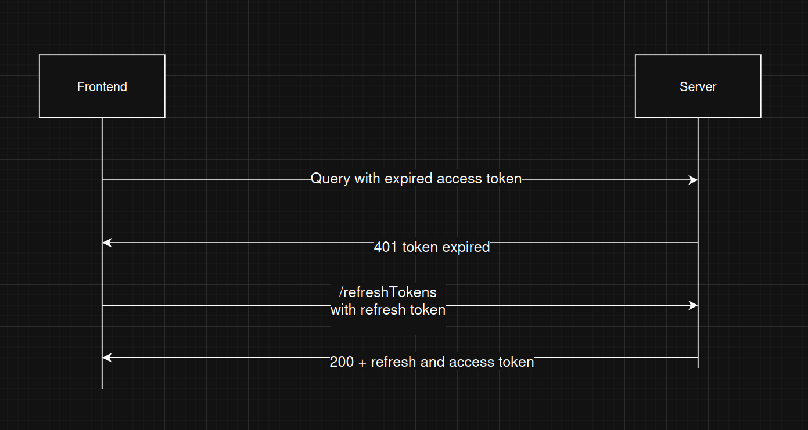
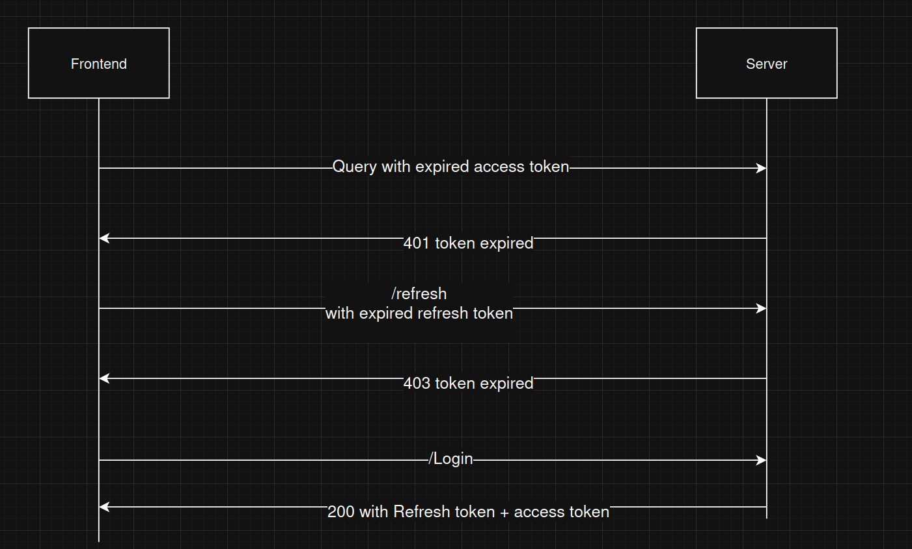
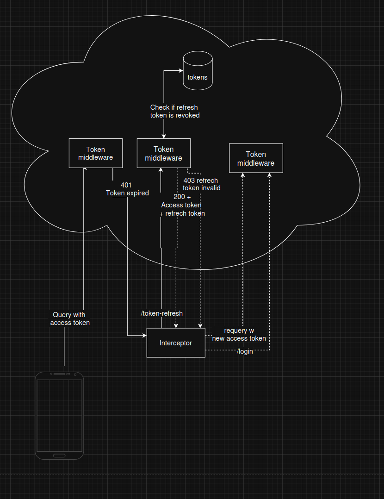

# Token lifecycle

Authentication is handled by 2 JWT tokens, short lived access token (1h) and long lived refresh token (30d). Idea is to provide for user the both tokens on login that the user is storing inside its device. Access token is used for application usage to authenticate user and when ever it is expired application interceptor will automatically try to refresh the tokens with refresh token. If it succeeds backend will provide new access and refresh token so user will continue with seamless login free exprerience for another 30 days.

In backend we store the refresh tokens for database so we can revoke the refresh tokens. The revoke will only take place when user is trying to refresh their expired access token. This will allow maximum of 1 hours of usage despite if the refresh token is revoked.

# Valid refreshtoken

# Expired refresh token

# Full picture

